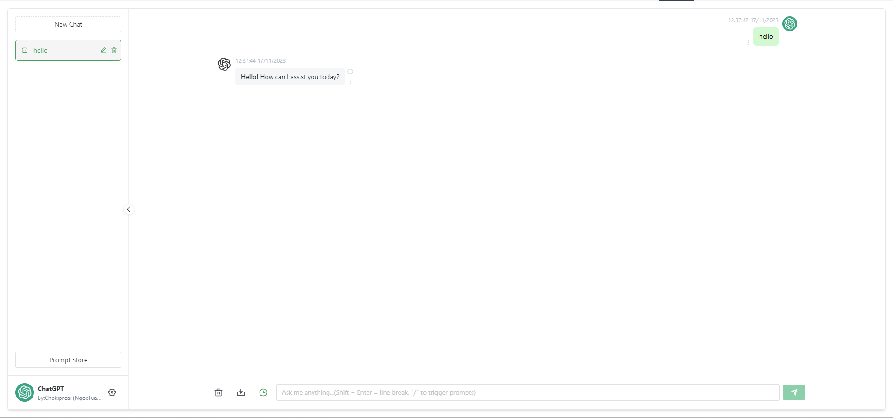
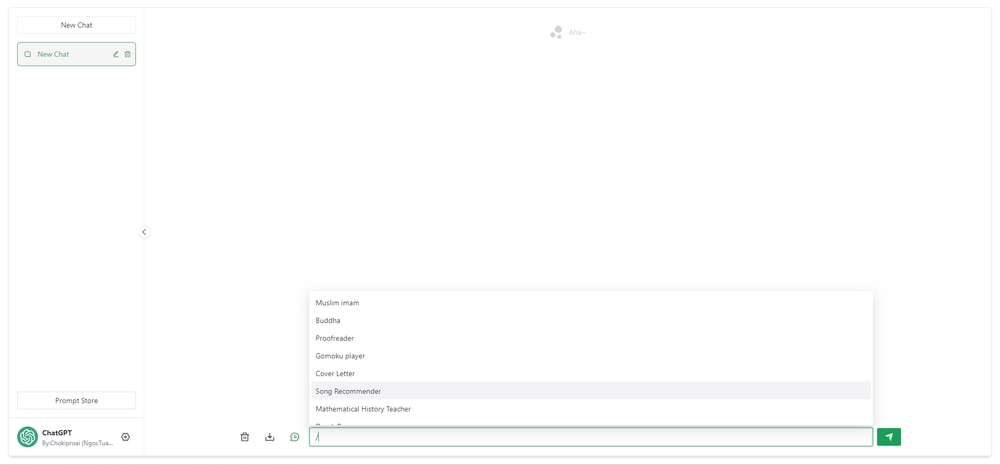

# ChatGPT 网页

<div style="font-size: 1.5rem;">
   <a href="./README.cn.md">中文</a> |
   <a href="./README.md">英文</a>
   <a href="./README.vi.md">越南语</a>
</div>
</br>

> 免责声明：本项目仅在 GitHub 上发布，遵循 MIT 许可证，免费且用于开源学习目的。 不会有帐户销售、付费服务、讨论组或论坛。 谨防欺诈。




- [ChatGPT 网页](#chatgpt-web)
- [简介](#简介)
- [路线图](#路线图)
- [先决条件](#先决条件)
- [节点](#节点)
- [PNPM](#pnpm)
- [填写按键](#fill-in-the-keys)
- [安装依赖项](#install-dependencies)
- [后端](#backend)
- [前端](#frontend)
- [在测试环境中运行](#run-in-test-environment)
- [后端服务](#backend-service)
- [前端网页](#frontend-webpage)
- [包装](#包装)
- [使用 Docker](#using-docker)
- [Docker 参数示例](#docker-parameter-example)
- [Docker 构建\& 运行](#docker-build--run)
- [Docker 撰写](#docker-compose)
- [铁路部署](#deployment-with-railway)
- [铁路环境变量](#railway-environment-variables)
- [手动包装](#manual-packaging)
- [后端服务](#backend-service-1)
- [前端网页](#frontend-webpage-1)
- [常见问题](#frequently-asked-questions)
- [贡献](#contributing)
- [赞助](#赞助)
- [许可证](#license)

＃＃ 介绍

支持双模型，提供两种非官方的`ChatGPT API`方法：

| 方法| 自由的？ | 可靠性 | 品质 |
| -------------------------------------------------------- | ------ | ----------- | -------- |
| `ChatGPTAPI(gpt-3.5-turbo-0301)` | 没有 | 可靠| 比较笨拙 |
| `ChatGPTUnofficialProxyAPI(Web accessToken)` | 是的 | 比较不靠谱| 智能|

比较：
1.`ChatGPTAPI`使用`gpt-3.5-turbo-0301`通过官方`OpenAI`完成`API`来模拟`ChatGPT`（最可靠的方法，但它不是免费的，并且没有使用专门为聊天调整的模型 ）。
2、`ChatGPTUnofficialProxyAPI`通过非官方代理服务器访问`ChatGPT`的后端`API`，绕过`Cloudflare`（使用真正的`ChatGPT`，非常轻量级，但依赖第三方服务器，有速率限制）。

[详情](https://github.com/Chanzhaoyu/chatgpt-web/issues/138)

切换方法：
1. 转到“service/.env.example”文件并将内容复制到“service/.env”文件中。
2. 对于“OpenAI API Key”，填写“OPENAI_API_KEY”字段[(获取 apiKey)](https://platform.openai.com/overview)。
3. 对于“Web API”，填写“OPENAI_ACCESS_TOKEN”字段[(获取 accessToken)](https://chat.openai.com/api/auth/session)。
4. 当两者都存在时，“OpenAI API Key”优先。

反向代理：

使用 `ChatGPTUnofficialProxyAPI` 时可用。[详情](https://github.com/transitive-bullshit/chatgpt-api#reverse-proxy)

````外壳
# 服务/.env
API_REVERSE_PROXY=
````

环境变量：

对于所有参数变量，请检查[此处](#docker-parameter-example)或参见：

````
/服务/.env
````

## 路线图
[✓] 双型号

[✓] 多会话存储和上下文逻辑

[✓] 格式化和美化类似代码的消息类型

[✓] 访问权限控制

[✓] 数据导入导出

[✓] 将消息保存到本地图片

[✓] 多语言界面

[✓] 界面主题

[✗] 更多...

## 先决条件

### 节点

`node` 需要版本 `^16 || ^18` (`node >= 14` 需要安装 [fetch polyfill](https://github.com/developit/unfetch#usage-as-a-polyfill))，并且可以管理多个本地 `node` 版本 使用 [nvm](https://github.com/nvm-sh/nvm)。

````外壳
节点-v
````

### PNPM
如果您之前没有安装过`pnpm`：
````外壳
npm 安装 pnpm -g
````

### 填写按键

获取 `Openai Api Key` 或 `accessToken` 并填写本地环境变量 [jump](#introduction)

````
# 服务/.env 文件

# OpenAI API 密钥 - https://platform.openai.com/overview
OPENAI_API_KEY=

# 将其更改为从 ChatGPT 站点的 `https://chat.openai.com/api/auth/session` 响应中提取的 `accessToken`
OPENAI_ACCESS_TOKEN=
````

## 安装依赖项

> 为了让‘后端开发者’更容易理解，我们没有使用前端‘workspace’模式，而是存放在不同的文件夹中。 如果您只需要对前端页面进行二次开发，则删除`service`文件夹。

### 后端

进入`/service`文件夹并运行以下命令

````外壳
即插即用安装
````

＃＃＃ 前端
在根目录下运行以下命令
````外壳
pnpm 引导程序
````

## 在测试环境中运行
### 后端服务

进入`/service`文件夹并运行以下命令

````外壳
启动
````

### 前端网页
在根目录下运行以下命令
````外壳
PNPM开发
````

＃＃ 包装

### 使用 Docker

#### Docker 参数示例

- `OPENAI_API_KEY` 两者之一
- `OPENAI_ACCESS_`