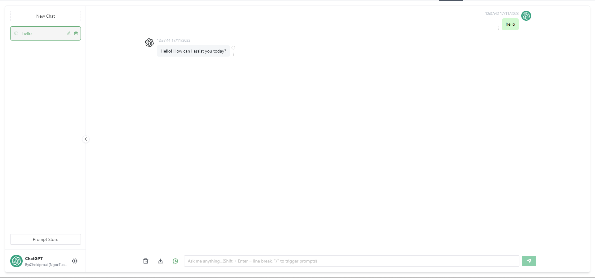
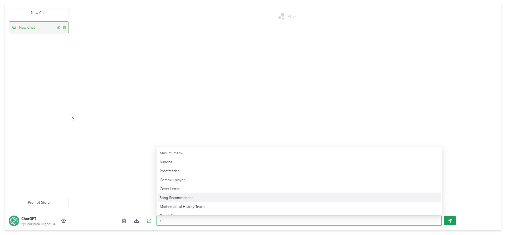

<h1 align="center">ChatGPT Web</h1>

## [Deployed on Hugging Face](https://huggingface.co/login?next=%2Fspaces%2Fngoctuanai%2Fchatgptfreev2%3Fduplicate%3Dtrue)

<div style="font-size: 1.5rem;">
   <a href="./README.md">Tiếng Anh</a>
</div>
</br>

> Tuyên bố miễn trừ trách nhiệm: Dự án này chỉ được phát hành trên GitHub, theo Giấy phép MIT, miễn phí và dành cho mục đích học tập nguồn mở. Sẽ không có bán tài khoản, dịch vụ trả phí, nhóm thảo luận hoặc diễn đàn. Hãy coi chừng lừa đảo.




- [Web ChatGPT](#web-chatgpt)
- [Giới thiệu](#giới-thiệu)
- [Lộ trình](#lộ-trình)
- [Điều kiện tiên quyết](#điều-kiện-tiên-quyết)
- [Nút](#nút)
- [PNPM](#pnpm)
- [Điền phím](#điền-chìa-khóa)
- [Cài đặt phụ thuộc](#cài-đặt-phụ-thuộc)
- [Phần cuối](#phần-cuối)
- [Giao diện người dùng](#giao-diện-người-dùng)
- [Chạy trong môi trường thử nghiệm](#chạy-trong-môi-trường-thử-nghiệm)
- [Dịch vụ phụ trợ](#dịch-vụ-phụ-trợ)
- [Trang web giao diện người dùng](#giao-diện-trang-web)
- [Bao bì](#bao-bì)
- [Sử dụng Docker](#sử-dụng-docker)
- [Ví dụ về tham số Docker](#ví-dụ-về-tham-số-docker)
- [Docker Build \& Run](#xây-dựng-và-chạy-docker)
- [Đóng gói thủ công](#biến-môi-trường-đường-sắt)
- [Dịch vụ phụ trợ](#Dịch-vụ-phụ-trợ)
- [Trang web giao diện người dùng](#trang-web-giao-diện-người-dùng)
- [Câu hỏi thường gặp](#câuhỏithườnggặp)
- [Giấy phép](#giấyphép)

## Giới thiệu

Hỗ trợ các mô hình kép, cung cấp hai phương thức `ChatGPT API` không chính thức:

| Phương pháp | Miễn phí? | Độ tin cậy | Chất lượng |
| --------------------------------------------- | ------ | ----------- | ------- |
| `ChatGPTAPI(gpt-3.5-turbo-0301)` | Không | Đáng tin cậy | Tương đối vụng về |
| `ChatGPTUnofficialProxyAPI(Web accessToken)` | Có | Tương đối không đáng tin cậy | Thông minh |

So sánh:
1. `ChatGPTAPI` sử dụng `gpt-3.5-turbo-0301` để mô phỏng `ChatGPT` thông qua `API` hoàn thành `OpenAI` chính thức (phương pháp đáng tin cậy nhất, nhưng nó không miễn phí và không sử dụng các mô hình được điều chỉnh riêng cho trò chuyện ).
2. `ChatGPTUnofficialProxyAPI` truy cập `API` phụ trợ của `ChatGPT` thông qua máy chủ proxy không chính thức để vượt qua `Cloudflare` (sử dụng `ChatGPT` thực, rất nhẹ, nhưng phụ thuộc vào máy chủ của bên thứ ba và có giới hạn tốc độ).

[Chi tiết](https://github.com/Chanzhaoyu/chatgpt-web/issues/138)

Phương pháp chuyển đổi:
1. Đi tới tệp `service/.env.example` và sao chép nội dung vào tệp `service/.env`.
2. Đối với `Khóa API OpenAI`, hãy điền vào trường `OPENAI_API_KEY` [(Nhận apiKey)](https://platform.openai.com/overview).
3. Đối với `Web API`, hãy điền vào trường `OPENAI_ACCESS_TOKEN` [(Nhận accessToken)](https://chat.openai.com/api/auth/session).
4. Khi cả hai đều có mặt, `Khóa API OpenAI` sẽ được ưu tiên.

Proxy ngược:

Có sẵn khi sử dụng `ChatGPTUnofficialProxyAPI`.[Chi tiết](https://api.chatanywhere.org/v1/oauth/free/github/render)

``` vỏ
# dịch vụ/.env
API_REVERSE_PROXY=
```

Biến môi trường:

Đối với tất cả các biến tham số, hãy kiểm tra [tại đây](#docker-parameter-example) hoặc xem:

```
/service/.env
```

## Lộ trình
[ ✓] Mô hình kép

[ ✓] Lưu trữ nhiều phiên và logic ngữ cảnh

[ ✓] Định dạng và làm đẹp các loại tin nhắn dạng mã

[ ✓] Kiểm soát quyền truy cập

[ ✓] Nhập và xuất dữ liệu

[ ✓] Lưu tin nhắn vào hình ảnh cục bộ

[ ✓] Giao diện đa ngôn ngữ

[ ✓] Chủ đề giao diện

[✗] Thêm...

## Điều kiện tiên quyết

### Nút

`node` yêu cầu phiên bản `^16 || ^18` (`node >= 14` yêu cầu cài đặt [fetch polyfill](https://github.com/developit/unfetch#usage-as-a-polyfill)) và có thể quản lý nhiều phiên bản `node` cục bộ sử dụng [nvm](https://github.com/nvm-sh/nvm).

``` vỏ
nút -v
```

### PNPM
Nếu bạn chưa cài đặt `pnpm` trước đây:
``` vỏ
npm cài đặt pnpm -g
```

### Điền chìa khóa

Nhận `Openai Api Key` hoặc `accessToken` và điền vào các biến môi trường cục bộ [jump](#introduction)

```
# tập tin dịch vụ/.env

# Khóa API OpenAI - https://platform.openai.com/overview
OPENAI_API_KEY=

# thay đổi giá trị này thành `accessToken` được trích xuất từ phản hồi `https://chat.openai.com/api/auth/session` của trang ChatGPT
OPENAI_ACCESS_TOKEN=
```

## Cài đặt phụ thuộc

> Để giúp `nhà phát triển phụ trợ` dễ hiểu hơn, chúng tôi không sử dụng chế độ `không gian làm việc` giao diện người dùng mà lưu trữ nó trong các thư mục khác nhau. Nếu bạn chỉ cần phát triển thứ cấp cho trang giao diện người dùng, hãy xóa thư mục `service`.

### Phần cuối

Nhập thư mục `/service` và chạy lệnh sau

``` vỏ
cài đặt pnpm
```

### Giao diện người dùng
Chạy lệnh sau trong thư mục gốc
``` vỏ
khởi động pnpm
```

## Chạy trong môi trường thử nghiệm
### Dịch vụ phụ trợ

Nhập thư mục `/service` và chạy lệnh sau

``` vỏ
bắt đầu vào buổi chiều
```

### Giao diện trang web
Chạy lệnh sau trong thư mục gốc
``` vỏ
nhà phát triển pnpm
```

## Bao bì

### Sử dụng Docker

#### Ví dụ về tham số Docker

- `OPENAI_API_KEY` một trong hai
- `OPENAI_ACCESS_TOKEN` một trong hai, `OPENAI_API_KEY` được ưu tiên khi cả hai đều có sẵnnt
- `OPENAI_API_BASE_URL` tùy chọn, khả dụng khi `OPENAI_API_KEY` được đặt
- `OPENAI_API_MODEL` tùy chọn, khả dụng khi `OPENAI_API_KEY` được đặt
- `API_REVERSE_PROXY` tùy chọn, khả dụng khi `OPENAI_ACCESS_TOKEN` được đặt [Tham khảo](#introduction)
- Mật khẩu truy cập `AUTH_SECRET_KEY`, tùy chọn
- Thời gian chờ `TIMEOUT_MS`, tính bằng mili giây, tùy chọn
- `SOCKS_PROXY_HOST` tùy chọn, có hiệu lực với SOCKS_PROXY_PORT
- `SOCKS_PROXY_PORT` tùy chọn, có hiệu lực với SOCKS_PROXY_HOST
- `SOCKS_PROXY_USERNAME` tùy chọn, có hiệu lực với SOCKS_PROXY_HOST và SOCKS_PROXY_PORT
- `SOCKS_PROXY_PASSWORD` tùy chọn, có hiệu lực với SOCKS_PROXY_HOST và SOCKS_PROXY_PORT
- `HTTPS_PROXY` tùy chọn, hỗ trợ http,https, vớ5
- `ALL_PROXY` tùy chọn, hỗ trợ http,https, vớ5


#### Xây dựng và chạy Docker

``` bash
docker build -t chatgpt .

# hoạt động tiền cảnh
docker run --name chatgpt --rm -it -p 127.0.0.1:3002:3002 --env OPENAI_API_KEY=your_api_key chatgpt-web

# hoạt động nền
docker run --name chatgpt -d -p 127.0.0.1:3002:3002 --env OPENAI_API_KEY=your_api_key chatgpt-web

# địa chỉ đang chạy
http://localhost:3002/
```


#### Biến môi trường đường sắt

| Biến Môi Trường        | Yêu Cầu                                                           | Mô Tả                                                                                                            |
|------------------------|-------------------------------------------------------------------|------------------------------------------------------------------------------------------------------------------|
| `PORT`                 | Yêu Cầu                                                           | Mặc định: `3002`                                                                                                  |
| `AUTH_SECRET_KEY`      | Tùy Chọn                                                          | Mật khẩu truy cập                                                                                                  |
| `TIMEOUT_MS`           | Tùy Chọn                                                          | Thời gian chờ trong mili giây                                                                                     |
| `OPENAI_API_KEY`       | Tùy Chọn                                                          | Yêu cầu cho `OpenAI API`. `apiKey` có thể được lấy từ [đây](https://platform.openai.com/overview).                |
| `OPENAI_ACCESS_TOKEN`  | Tùy Chọn                                                          | Yêu cầu cho `Web API`. `accessToken` có thể được lấy từ [đây](https://chat.openai.com/api/auth/session).         |
| `OPENAI_API_BASE_URL`  | Tùy Chọn, chỉ cho `OpenAI API`                                    | Địa chỉ API.                                                                                                     |
| `OPENAI_API_MODEL`     | Tùy Chọn, chỉ cho `OpenAI API`                                    | Mô hình API.                                                                                                      |
| `API_REVERSE_PROXY`    | Tùy Chọn, chỉ cho `Web API`                                       | Địa chỉ đảo ngược proxy cho `Web API`. [Chi tiết](https://github.com/transitive-bullshit/chatgpt-api#reverse-proxy) |
| `SOCKS_PROXY_HOST`     | Tùy Chọn, hiệu quả với `SOCKS_PROXY_PORT`                        | Socks proxy.                                                                                                     |
| `SOCKS_PROXY_PORT`     | Tùy Chọn, hiệu quả với `SOCKS_PROXY_HOST`                        | Cổng Socks proxy.                                                                                                |
| `SOCKS_PROXY_USERNAME` | Tùy Chọn, hiệu quả với `SOCKS_PROXY_HOST` & `SOCKS_PROXY_PORT`   | Tên người dùng Socks proxy.                                                                                      |
| `SOCKS_PROXY_PASSWORD` | Tùy Chọn, hiệu quả với `SOCKS_PROXY_HOST` & `SOCKS_PROXY_PORT`   | Mật khẩu Socks proxy.                                                                                            |
| `HTTPS_PROXY`          | Tùy Chọn                                                          | Proxy HTTPS.                                                                                                     |
| `ALL_PROXY`            | Tùy Chọn                                                          | Tất cả Proxy.                                                                                                    |


#### Dịch vụ phụ trợ

> Nếu bạn không cần giao diện `node` của dự án này, bạn có thể bỏ qua các bước sau.

Sao chép thư mục `service` vào máy chủ có môi trường dịch vụ `node`.

``` vỏ
# Cài đặt
cài đặt pnpm

# Xây dựng
xây dựng pnpm

# Chạy
sản phẩm pnpm
```

Tái bút: Bạn cũng có thể chạy `pnpm start` trực tiếp trên máy chủ mà không cần đóng gói.

#### Trang web giao diện người dùng
1. Tham khảo nội dung tệp `.env.example` thư mục gốc để tạo tệp `.env`, sửa đổi `VITE_GLOB_API_URL` trong `.env` tại thư mục gốc thành địa chỉ giao diện phụ trợ thực tế của bạn.
2. Chạy lệnh sau trong thư mục gốc rồi sao chép các tệp trong thư mục `dist` vào thư mục gốc của dịch vụ trang web của bạn.

[Thông tin tham khảo](https://cn.vitejs.dev/guide/static-deploy.html#building-the-app)

``` vỏ
xây dựng pnpm
```

## Các câu hỏi thường gặp

Hỏi: Tại sao Git luôn báo lỗi khi commit?

Đáp: Vì phải xác minh thông tin gửi nên vui lòng tuân theo [Nguyên tắc cam kết](./CONTRIBUTING.en.md).

Câu hỏi: Thay đổi giao diện yêu cầu ở đâu nếu chỉ sử dụng trang giao diện người dùng?

Trả lời: Trường `VITE_GLOB_API_URL` trong tệp `.env` ở thư mục gốc.

Q: Tất cả đều màu đỏ khi lưu tệp?

Trả lời: Đối với `vscode`, vui lòng cài đặt plug-in được đề xuất của dự án hoặc cài đặt plug-in `Eslint` theo cách thủ công.

Hỏi: Tại sao giao diện người dùng không có hiệu ứng máy đánh chữ?

Trả lời: Một lý do có thể là sau khi ủy quyền ngược Nginx, tính năng đệm được bật và Nginx sẽ cố gắng đệm một lượng dữ liệu nhất định từ phần phụ trợ trước khi gửi nó tới trình duyệt. Vui lòng thử thêm `proxy_buffering off;` sau tham số proxy ngược rồi tải lại Nginx. Các cấu hình máy chủ web khác cũng tương tự.

Hỏi: Nội dung trả về không đầy đủ?

Đáp: Có giới hạn độ dài cho nội dung được API trả về mỗi lần. Bạn có thể sửa đổi trường `VITE_GLOB_OPEN_LONG_REPLY` trong tệp `.env` trong thư mục gốc, đặt thành `true` và xây dựng lại giao diện người dùng để bật tính năng trả lời dài, có thể trả về toàn bộ nội dung. Cần lưu ý rằng việc sử dụng tính năng này có thể mang lại nhiều phí sử dụng API hơn.


## Giấy phép
MIT © [chokiproai](./license)
